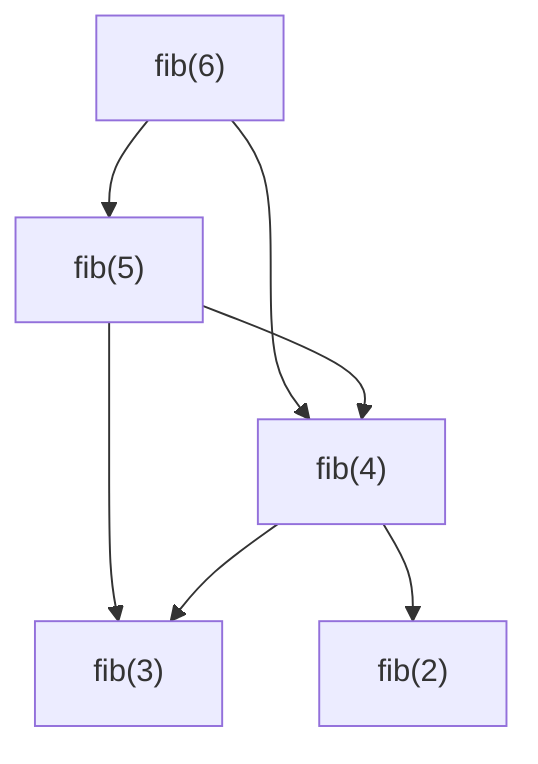

# Dynamic Programming

IMHO, this chapter of the book is needlessly excessive. However, it does a great job at explaining the whys.

The ideas in this chapter can be boiled down to the following things:

- Dynamic Programming is a recursion optimization paradigm
- The single best things you can do to optimize a recursion is having less calls that recurse
- You achieve that in two ways:
    - Use _memoization_ -> Store the values that are reused in consequent function calls
    - Don't use recursion ( wow... )

The examples illustrating this are worth reading though.

The book starts off with an example where we calculate max value:

```go
func max(list []int) int {
    if len(list) == 1 {
        return list[0]
    }

    if list[0] > max(list[1:]) {
        return list[0]
    }
    return max(list[1:])
}
```

Now, the things that should immediately jump out to you is that `max(list[1:])` is called twice. That is entirely
unnecessary and will result in many calls to the same thing with the same value. Let's store that value and
improve our algorithm. ( This algorithm right now is O(2^n). Which is the worst possible efficiency. )

```go
func max(list []int) int {
    if len(list) == 1 {
        return list[0]
    }

    currentMax := max(list[1:])
    if list[0] > currentMax {
        return list[0]
    }
    return currentMax
}
```

This tiny modification brought our algorithm down to O(n)!! What a change.

## Overlapping Subproblem

Now comes the exciting part. When a problem is solved by solving a smaller set of the same problem, that's a
subproblem. These sub-problems overlap if they solve the same thing with the same function call.

Let's demonstrate that with the Fibonacci sequence.

```go
func fib(n int) int {
    if n < 2 {
        return n
    }
    return fib(n - 2) + fib(n - 1)
}
```

There are two calls. Imagine this being 6.



... and so on. You can see that there are a lot of overlapping calls. At least two to fib(4) and two to fib(3).
If we knew the value already of those calls, we could omit that function call and just return the value.

## Memoization

Memoization is using. It remembers values of previous calls. But, don't forget, that this is a recursive call. So you
need to take the map with you to remember where you are. In Go, we can use a `map` for this.

Let's improve our fib function by remembering values for calls of `n`. And if a call for `n` comes along, we simply
return the value.

```go
func fib(n int, m map[int]int) int {
    if n < 2 {
        return n
    }

    if v, ok := m[n]; ok {
        return v
    }

    // memoization occurs here
    m[n] = fib(n - 2, m) + fib(n - 1, m)
    return m[n]
}
```

This is more of an art than science. You have to understand and analyze the problem over and over to find a place where
you can memoize return values effectively. Luckily, this can be made simple by practicing it a lot. After a while, you
begin to see that most problems have a similar core and once you find that, you'll know where to save values.

## Exercise

1. The following function accepts an array of numbers and returns the sum as long as it's below 100. If it is above 100
the number is ignored which brings it to 100. However, there are some not needed calls, see if you can remove them.

```go
func addUntil100(list []int) int {
    if len(list) == 0 {
        return 0
    }

    if list[0] + addUntil100(list[1:]) > 100 {
        return addUntil100(list[1:])
    }
    return list[0] + addUntil100(list[1:])
}
```

Answer: So it calls add over and over again. We can simplify this by saving the result and using that in all places.

```go
func addUntil100(list []int) int {
    if len(list) == 0 {
        return 0
    }

    n := addUntil100(list[1:])
    if list[0] + n > 100 {
        return n
    }
    return list[0] + n
}
```

2. The following function calculates the Nth number from a sequence called Golomb Sequence.
Use memoization to optimize it. ( you don't have to know what Golomb is to do that. )

```go
func golomb(n int) int {
    if n == 1 {
        return 1
    }

    return 1 + golomb(n - golomb(golomb(n - 1)))
}
```

Answer: I have to unravel this first. See which calls result in the same `n`. Then use memoization to return that value.
I added some printf to golomb to see what's happening. For `Golomb(6)` I've got:

```
6
5
4
3
2
1
1
1
2
1
1
1
1
2
1
1
1
2
1
1
1
3
2
1
1
1
2
1
1
1
1
3
2
1
1
1
2
1
1
1
1
3
2
1
1
1
2
1
1
1
1
4
3
2
1
1
1
2
1
1
1
1
2
1
1
1
2
1
1
1
```

Which is quite big and we can see a lot of repeats. So let's try adding a simple memoization to `n`.

This works:

```go
func Golomb(n int, m map[int]int) int {
	if n == 1 {
		return 1
	}

	if v, ok := m[n]; ok {
		return v
	}

    m[n] = 1 + Golomb(n-Golomb(Golomb(n-1, m), m), m)

	return m[n]
}
```

But did it remove extra calls? No, it did not. So can we maybe improve that nested call? I don't think so, because the
calls differ. And in fact, that's what the book did as well.

3. Here is a solution to unique path. Use memoization to improve it.

```go
func UniquePath(rows, columns int) int {
    if rows == 1 || columns == 1 {
        return 1
    }
    return UniquePath(rows - 1, columns) + UniquePath(rows, columns - 1)
}
```

Okay, let's analyze again. Let's see if we print the rows, columns can we get a feel of the land?
```
3 7
2 7
1 7
2 6
1 6
2 5
1 5
2 4
1 4
2 3
1 3
2 2
1 2
2 1
3 6
2 6
1 6
2 5
1 5
2 4
1 4
2 3
1 3
2 2
1 2
2 1
3 5
2 5
1 5
2 4
1 4
2 3
1 3
2 2
1 2
2 1
3 4
2 4
1 4
2 3
1 3
2 2
1 2
2 1
3 3
2 3
1 3
2 2
1 2
2 1
3 2
2 2
1 2
2 1
3 1
```

Printing we get pairs. There are a lot of duplicates of pairs. What if we cache the pair?

```go
type pair struct {
	row int
	col int
}


func UniquePath(rows, columns int, m map[pair]int) int {
	p := pair{row: rows, col: columns}
	if rows == 1 || columns == 1 {
		return 1
	}

	if v, ok := m[p]; ok {
		return v
	}

	m[p] = UniquePath(rows-1, columns, m) + UniquePath(rows, columns-1, m)

	return m[p]
}
```

Yes, we can. This worked. Let's take a final look at the two calls. Can we remove one? No, because it's called
differently. And indeed, that's all the book has to say as well.

There are multiple ways to memoize something. It can be not just a single number, but a pair or a triplet of items.
