# Speeding up all the things with binary search trees

## Binary Search Trees

The difference is that a binary search tree has two nodes. One left and one right. The left side only contains values
that are less than the parent value. And the right side only contains values greater than the parent
value.

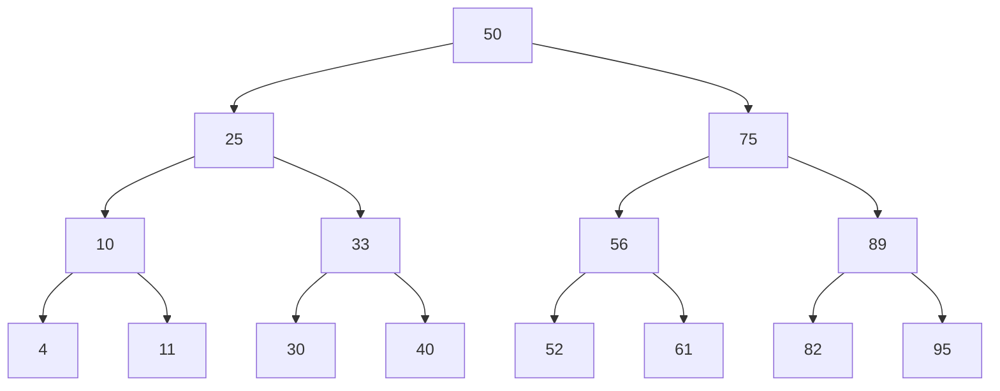

Representing something like a Binary Tree could look like this:

```go
// Number covers all numeric types.
type Number interface {
	int | int8 | int16 | int32 | int64 | float32 | float64
}

// Leaf is a node in a binary search tree.
type Leaf[T Number] struct {
	Left  *Leaf[T]
	Right *Leaf[T]
	Data  T
}
```

I also implemented creating a binary search tree from a slice of random numbers.

```go
func NewBinarySearchTree[T Number](nums []T) *Leaf[T] {
	if len(nums) == 0 {
		return nil
	}
	first := &Leaf[T]{
		Data: nums[0],
	}

	for _, n := range nums {
		first.Insert(n)
	}

	return first
}
```

`Insert` will be discussed later...

### Searching

The steps to searching are as follows:

1. Designate a node to be the current node
2. Compare
3. If found, break if not continue with step 4
4. If value is less than current value search the left side
5. If value is greater than current value search the right side
6. Repeat 1-5

Note, this, of course, only works for numbers... Any other type should be stored in some other manner.

### Efficiency of Searching a Binary Search Tree

You'll see that each step eliminates half of the remaining nodes to search. We remember from previous chapters that
halving the things that we have to search that will eventually come down to 1 is a logarithmic scale. So the efficiency
is O(logN).

This leads to the following: _if there are N nodes in a balanced binary tree there will be log N levels for it_.

Let's implement searching.

```go
func Search[T Number](l *Leaf[T], val T) *Leaf[T] {
	if l == nil || l.Data == val {
		return l
	}

	if val < l.Data {
		return Search(l.Left, val)
	}
	if val > l.Data {
		return Search(l.Right, val)
	}
	return nil
}
```

It's this simple.

### Insertion

Remember that a binary search tree follows the rules that lower values go to the left, higher values go to the right.
Which means, Insertion is simply following these rules recursively. In Go this is semi-hidden recursive because we will
call `Insert` on the Left and the Right side.

```go
func (l *Leaf[T]) Insert(val T) {
	if val < l.Data {
		if l.Left == nil {
			l.Left = &Leaf[T]{Data: val}
		} else {
			l.Left.Insert(val)
		}
	} else if val > l.Data {
		if l.Right == nil {
			l.Right = &Leaf[T]{Data: val}
		} else {
			l.Right.Insert(val)
		}
	}
}
```

This will traverse the tree and insert any value on the right side of the previous Leaf. It's worth pointing out that
inserting random data, will result in a well-balanced tree. If we tried to insert sorted data, it would result in an
"ugly" tree. That is an unbalanced tree.

For example, inserting [1, 2, 3, 4, 5] would result in such a tree:

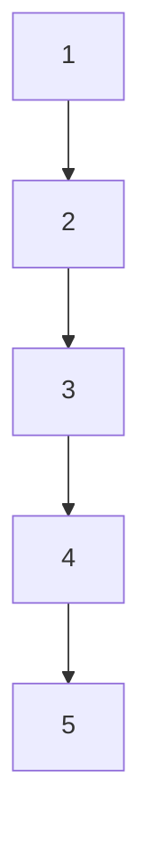

Not much of a tree. There are a couple of ways to balance a binary search tree. But the book doesn't cover these.

### Deletion

Deletion is a bit more complex because you have to think about which node to replace the deleted node with, if any.
We differentiate between three scenarios:

- The node is empty
	- simply remove it
- The node has one child
	- replace the node with the child node
- The node has two children
	- in this case the successor node will be the node with the least of all values that are greater than the deleted
	node

### Node is empty:


Removing `4` here, is simply removing it.

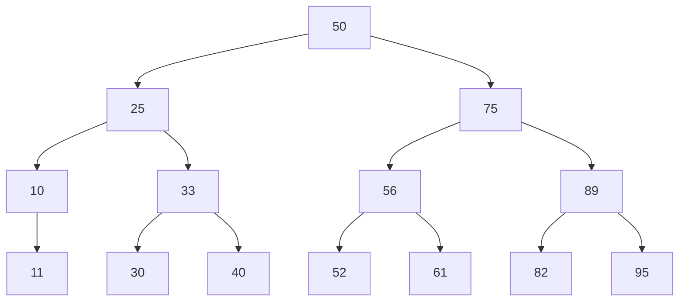

### Node has one child

Now, from the previous tree, let's remove the node `10`. `11` ends up just dangling there. But what we do in this case
is to replace the 10 with the 11 value.


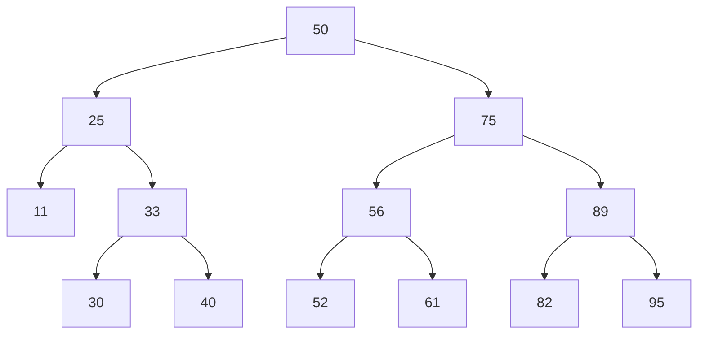

### Node has two children

Let's try deleting node 56 from the previous tree. It has two nodes, so try and find the successor node.

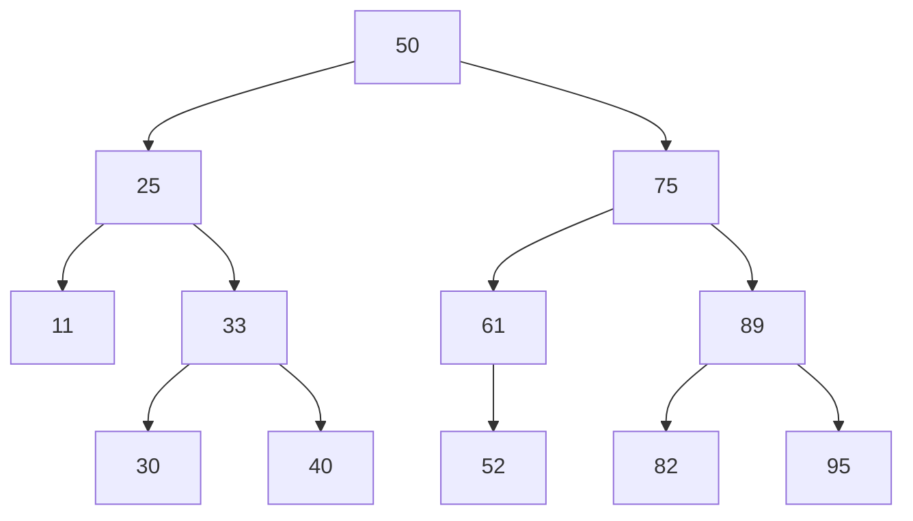

Turns out `61` is the successor because that's smallest value that is still greater than the deleted node.

Let's try a more challenging example. Let's delete the root node `50`.

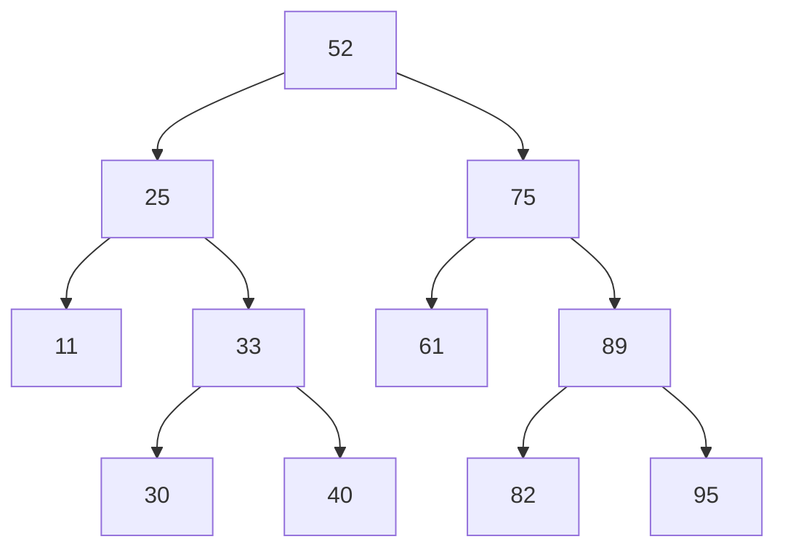

The replacing value is `52`. We go to the right of the root node to find the largest number and then we traverse to left continuously. The bottom value will be the new root node.

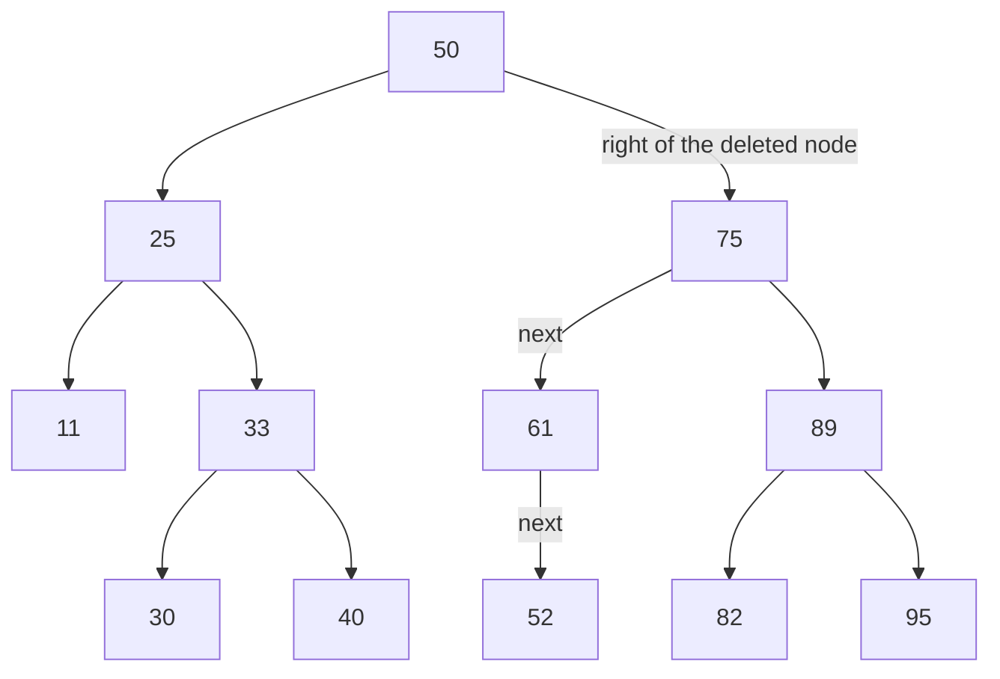

But what if the node that's the last only has a `right` side child and no `left` side child?

Let's consider the following tree from the previous example, but we added a 55 on the right side for 52.

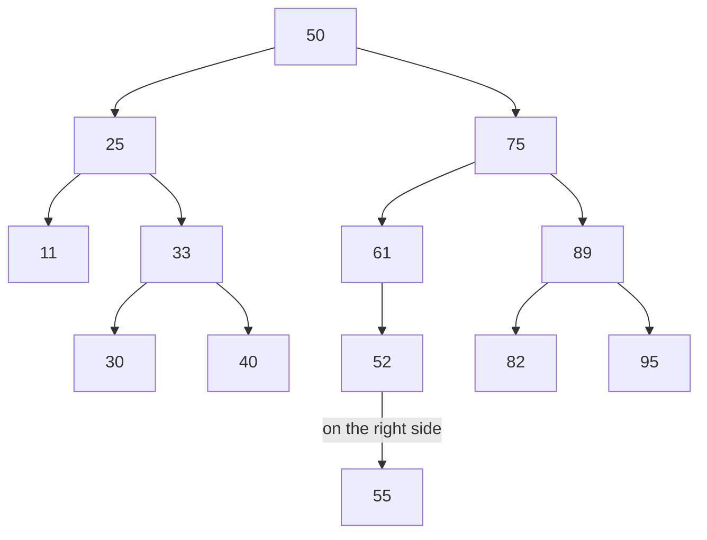

Rule is that _take the former child of the successor node and turn it into the **left child of the former parent of the successor node**_.

This is quite the handful. Let's break it down. Take the former child (55) turn it into the left child ( so put it on the left side ) of the former parent (61 which is the former parent of number 52.) of the successor node.

So, 55 becomes the left side child of 61.

Again, we delete the root node, and this will be the end result:

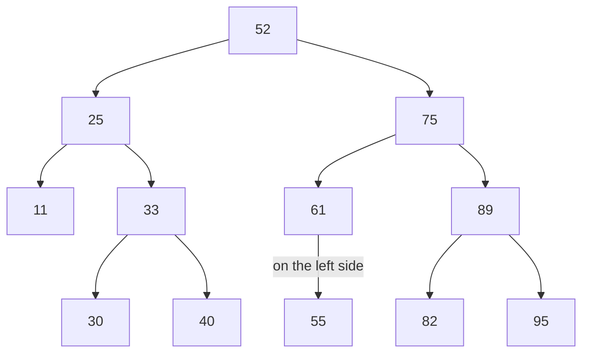

Now we are complete. How does this look like in code? Well, with lots of ifs...

```go
func Delete[T Number](node *Leaf[T], val T) *Leaf[T] {
	// base case is that we found the bottom leave and the parent node has no children.
	if node == nil {
		return nil
	}

	if val < node.Data {
		// If the value is smaller than the current data, we set left side to the result
		// of the recursive delete call.
		node.Left = Delete(node.Left, val)
		return node
	} else if val > node.Data {
		// If the value is greater than the current data, we set right side to the result
		// of the recursive delete call.
		node.Right = Delete(node.Right, val)
		return node
	} else if val == node.Data {
		// if the current node is the value we want to delete..

		// if the current node has no left child return the right side and it's subtree.
		if node.Left == nil {
			return node.Right
		}
		// if the current node has no right child return the left side and it's subtree.
		if node.Right == nil {
			return node.Left
		}
		// If there are two children, we call lift on the right side. ( this is where we
		// pivot to the right first, then traverse the left side ).
		node.Right = lift(node.Right, node)
		return node
	}

	return nil
}

func lift[T Number](node *Leaf[T], toDelete *Leaf[T]) *Leaf[T] {
	// if current node has a left side, we continue down the left side
	if node.Left != nil {
		node.Left = lift(node.Left, toDelete)
		return node
	}
	// if the current node has no left child that means we found our successor node
	// so we take its value and return the right side of the node ( which might be nil ).
	toDelete.Data = node.Data
	return node.Right
}
```

That is a lot to take in. I tried commenting where it made sense. Efficiency of `Delete` is typically also O(logN).

### Practical Usages of Binary Search Tree

For example, imagine a book store which has millions of titles that they would like to see an alphabetically ordered
list of from time to time. But this changes a lot, on a daily bases, multiple times. Representing it with a Binary Tree
actually speeds up this process by a lot.

Imagine a tree like this:

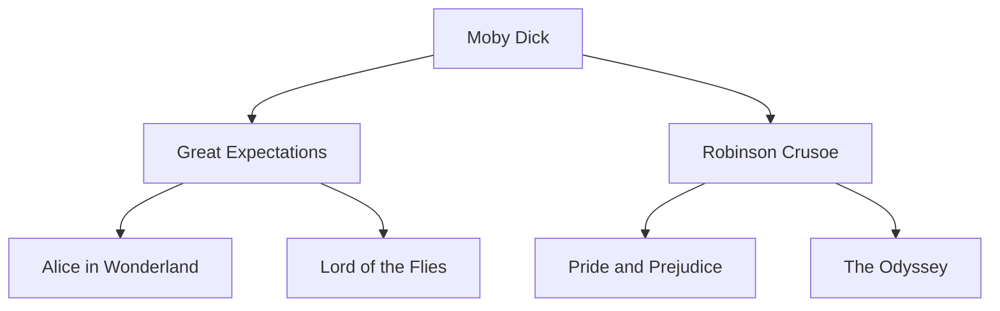

### Traversing a Binary Tree

I did something like this when I was implementing `Display` to see if my tree is correct.
The code I used is the same as the one described by the book.

It's called _inorder traversal_. It's a really simple recursive function:

```go
func Display[T Number](l *Leaf[T]) {
	if l == nil {
		return
	}
	if l.Left != nil {
		fmt.Printf("%v-->%v\n", l.Data, l.Left.Data)
		Display(l.Left)
	}
	if l.Right != nil {
		fmt.Printf("%v-->%v\n", l.Data, l.Right.Data)
		Display(l.Right)
	}
}
```

Basically, recursively call left and right and display the data they have. This is O(n) because it walks through all the
nodes.

## Exercises

1. Create a binary tree out of these values [1, 5, 9, 2, 4, 10, 6, 3, 8] being inserted in this order.

Answer:
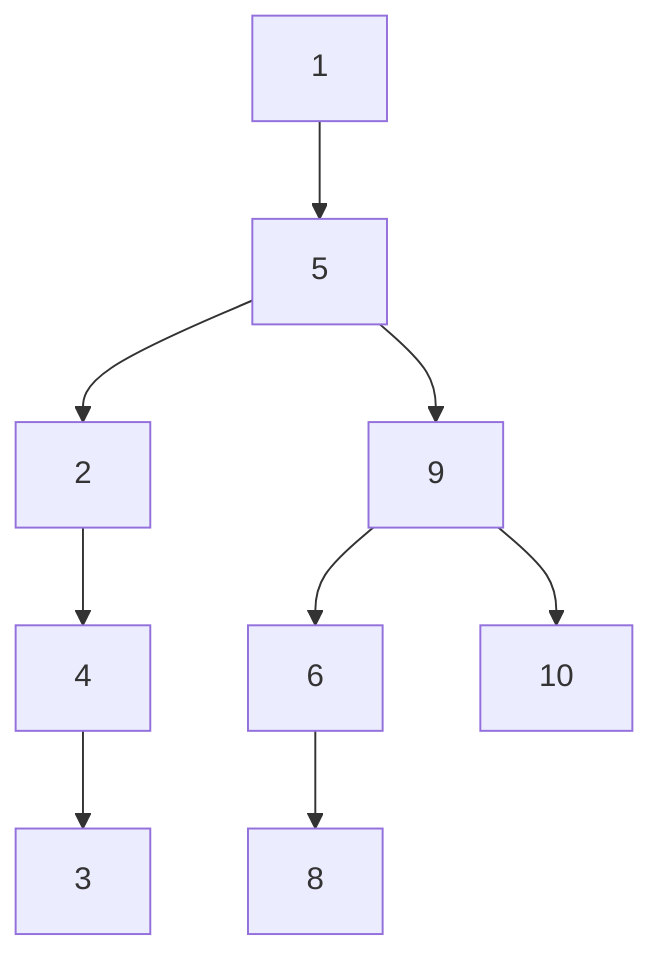

Arguably, I can't really make it look like the actual, since I can't force `mermaid` to display it on the left side.

2. A well-balanced search tree contains a 1000 items. How many steps would it take to search it?
Answer: 10. Because O(logN).

3. Write an algorithm that finds the greatest value within a binary search tree.

```go
func max(node *Leaf) int {
	if node.Right != nil {
		return max(node.Right)
	}
	return node.Value
}
```

We simply travel down the right side. A well balanced tree contains all the maximum values on the right side.

4. Another way of traversing is _preorder_ traversal. Here is the code:

```go
func traverseAndPrint(node *Leaf) {
	if node == nil {
		return
	}
	fmt.Println(node.Value)
	traverseAndPrint(node.Left)
	traverseAndPrint(node.Right)
}
```

What order would this print the previous book example?

```
Moby Dick
Great Expectations
Alice in Wonderland
Lord of the Flies
Robinson Crusoe
Pride and Prejudice
The Odyssey
```

5. And lastly there is postorder traversal which looks like this:

```go
func traverseAndPrint(node *Leaf) {
	if node == nil {
		return
	}
	traverseAndPrint(node.Left)
	traverseAndPrint(node.Right)
	fmt.Println(node.Value)
}
```

What's the order now?

```
Alice in Wonderland
Lord of the Flies
Great Expectations
Pride and Prejudice
The Odyssey
Robinson Crusoe
Moby Dick
```