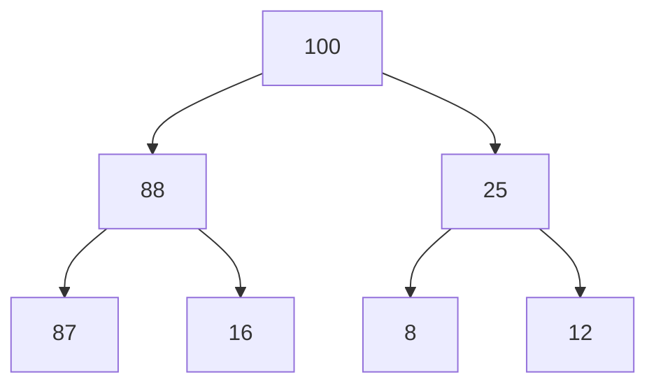
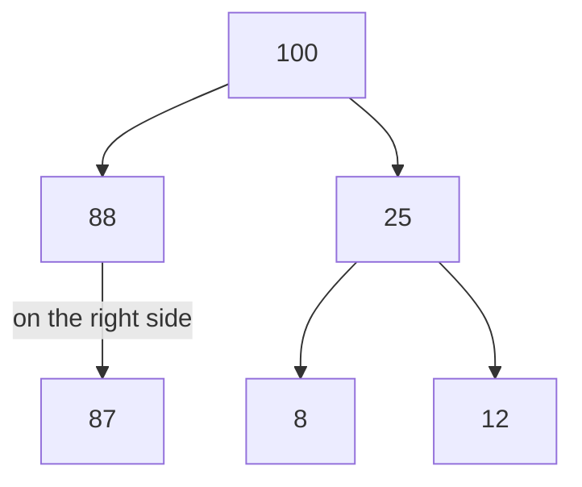
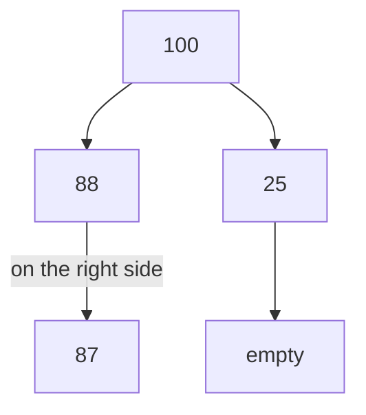
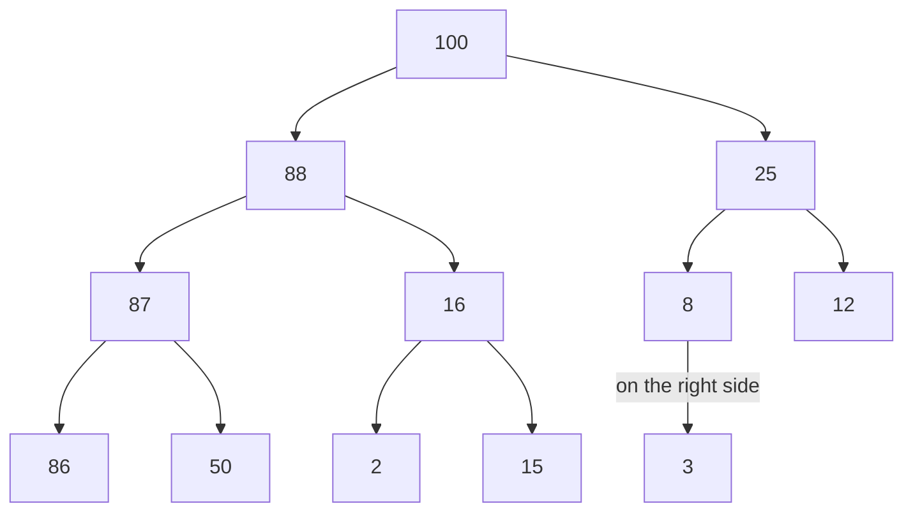
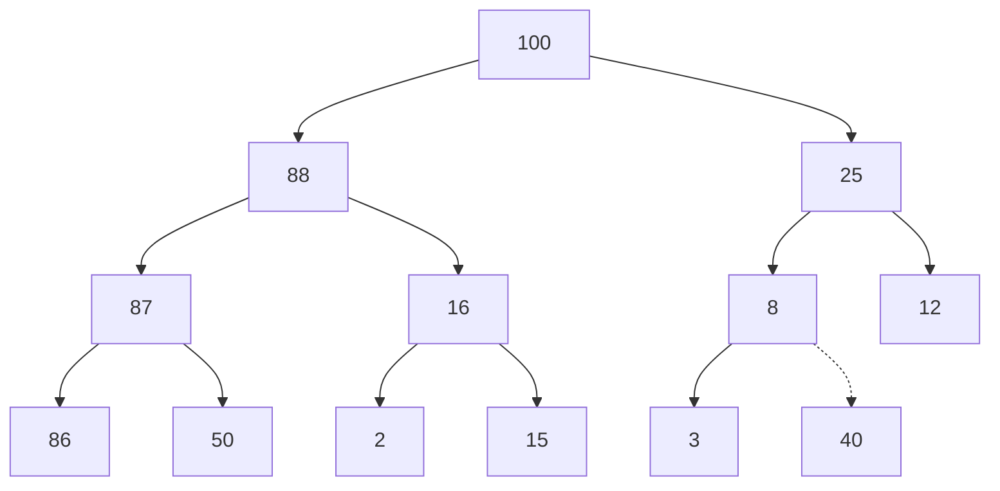
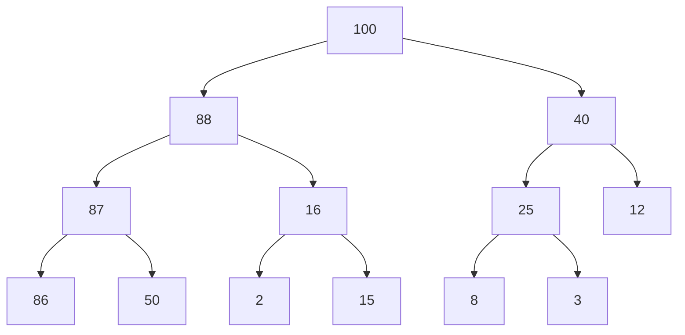
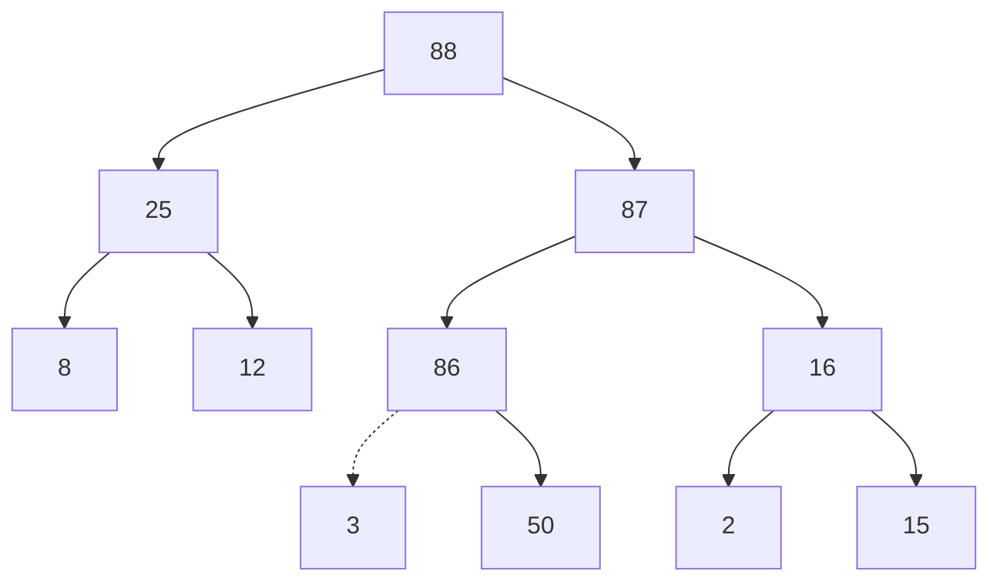
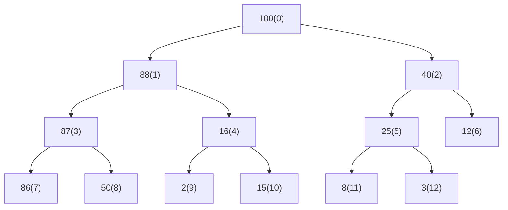

# Keeping Your Priorities Straight with Heaps

Now that we know what trees are, we can explore some neat algorithms that are very useful in certain situations.

The next in the list is `Heap`. But to understand and appreciate `Heap` we first need to discuss `Priority Queues`.

## Priority Queues

A Priority Queue is like a queue, but its elements are sorted in a specific manner. Deletion and access are the same as
for a normal queue, but insertion is like an ordered list.

Imagine a priority queue like the triage process in an emergency room. The most severe cases are the first one
to deal with, even if they came AFTER a case that has been there for a while.

The following constraints apply to the priority queue:

- On insertion, order MUST be maintained
- Data can only be removed from the end of the queue ( this is the front of the queue )

Looking at the efficiency, we know that inserting into an ordered list is always O(n) because we need to reshuffle its
elements.

However, we have another option. A better foundation for a priority queue is the `Heap`.

## Heaps

There are many different heaps, but we will focus on the _binary heap_. And out of those, we will be looking at what's
called a `max_heap`. Meaning the root element is always the largest number.

A Heap is a binary tree with the following added constraints:

- The value of each node must be greater than each of its children's values.
- The tree MUST be _complete_. ( more on this later )

These two are called _heap conditions_.

## Heap condition

Let's look at the first condition.

- The value of each node must be greater than each of its children's values.

It looks like this in practice:



As you can see, all values are greater than ANY value from ANY of their descendants. A `min_heap` is the opposite of
this.

## Complete Trees

Now, the second:

- The tree MUST be _complete_.

It means that only the last row can be empty, and even that can only be empty if there are no empty right nodes.

Let's look at this in practice:

This is complete:


This is incomplete:


Because the last row has a gap in-between the nodes.

This is complete:


Because the last node is on the right side and there are no more nodes.
( I had to put `empty` in there otherwise mermaid messes up the flow. ).

## Heap Properties

Heaps are considered _weakly ordered_. The difference comes from the fact that as opposed to binary trees, values can
be anywhere AS LONG as they remain smaller than anything above them. Therefore, searching is not a good action to do
within a heap. It's two main operations are `insertion` and `deletion`.

To understand both, we also need to keep in mind a thing called _the last node_ which is the right most node at the
bottom level.

## Heap Insertion

Insertion follows these steps:

- Create a node and insert it as _the last node_. So at the rightmost bottom level. This node will then become _the last node_.
- Compare the new node with its parent nodes
    - If it's greater than its parent, they swap positions
    - If it's lower than its parent, we are done
- Repeat until we are done

Let's look at an example:



We add the value `40`.



Now we _trickle_ the node up. As we check each parent, it will eventually end up replacing `25`. It switches places
with all elements as it slowly trickles up the node chain.



Inserting into a heap is of O(log N) efficiency.

## Looking for the Last Node

For us, it's easy to see which the last node is, but the computer doesn't have eyes. So we need a way to consistently
detect which is the last node.

We'll come back to this after we talk about deletion.

## Heap Deletion

_We only ever deletion the ROOT node_. Since that has the highest priority.

To delete it:

- Move the last node where the root node was
- Trickle the new value DOWN until it reaches its right position

For the trickle, there are three rules:

- We check each node which one is greater than the current node.
- If both are, we select the greatest.
- If the node is smaller than the largest of them, we swap places.
- Repeat until no more nodes are greater than our node.

Let's look at the above example. If we would delete the root node `100` then the last node would take its place which is
the node `3`. That node then would start trickling _down_ to its right place continuously comparing itself to all nodes
and their values and then swapping places.

In the end the result would be this:



( I can't seem to fix the ordering of this tree. )

|           | Ordered Array | Heap     |
| --------- | ------------- | -------- |
| Insertion | O(N)          | O(log N) |
| Deletion  | O(1)          | O(log N) |

Looking at this table, we can see that choosing a heap over a regular ordered array can be beneficial. Since deletion
and insertion are performed regularly we want them to be fast.

## The problem of the last node

So, how do we determine the last node? Well, turns out, most of the time a heap is implemented using a list underneath.
This, combined, with a special way of indexing the nodes will gives the ability to pick the last node because it will be
located at the end of the list.

Indexing the nodes is really simple:




I think it's apparent from this that the indexing scheme is top-down left-right. The last node will be always at the end
of the list. When we insert a new element we do so by appending it to the end.

Let's initialize our Heap:

```go
// Heap .
type Heap[T any] struct {
	data []T
}

func (h *Heap[T]) RootNode() (T, error) {
	var t T
	if len(h.data) == 0 {
		return t, errors.New("not items")
	}
	return h.data[0], nil
}

func (h *Heap[T]) LastNode() (T, error) {
	var t T
	if len(h.data) == 0 {
		return t, errors.New("not items")
	}
	return h.data[len(h.data)-1], nil
}

// NewHeap creates a new heap.
func NewHeap[T any](data []T) *Heap[T] {
	return &Heap[T]{
		data: data,
	}
}
```

Right off the bat, we get two functions that we'll use later on. `RootNode` and `LastNode`.
Since we will eventually need to determine which is the previous and the next node in the array, let's add those two
methods as well.

```go
func (h *Heap[T]) LeftChild(index int) (int, bool) {
	i := (index * 2) + 1
	if i > len(h.data)-1 {
		return -1, false
	}
	return i, true
}

func (h *Heap[T]) RightChild(index int) (int, bool) {
	i := (index * 2) + 2
	if i > len(h.data)-1 {
		return -1, false
	}
	return i, true
}

func (h *Heap[T]) Parent(index int) (int, bool) {
	i := (index - 1) / 2
    // this might never occur
	if i < 0 {
		return -1, false
	}
	return i, true
}
```

## Heap Insertion Code

Now, we can implement insertion:

```go
func (h *Heap[T]) Insert(val T) {
	// Add the value as the last node
	h.data = append(h.data, val)

	// The index of the new node
	index := len(h.data) - 1

	// Trickle up

	// If the new node is not root and greater than current node:
	parentIndex, ok := h.Parent(index)
    if !ok {
        return
    }
	for index > 0 && h.data[index] > h.data[parentIndex] {
		// Do the swap
		h.data[parentIndex], h.data[index] = h.data[index], h.data[parentIndex]
		// Update the index of the new node to the swapped node
		index = parentIndex
	}
}
```

## Heap Deletion Code

And with that in place, we can also implement deletion. This will be slightly more involved:

```go

// Delete will delete the root node. The only delete ever allowed.
// For posterity it ignores if the data value is of 0 length.
func (h *Heap[T]) Delete() {
	// Make the last node the new root node
	var lastNode T
	// Pop
	lastNode, h.data = h.data[len(h.data)-1], h.data[:len(h.data)-1]
	h.data[0] = lastNode

	trickleIndex := 0

	// Loop until there is a child which has a higher value.
	for h.HasGreaterChild(trickleIndex) {
		// Get the largest child
		largerChildIndex := h.CalculateLargerChildIndex(trickleIndex)

		// Do the swap
		h.data[trickleIndex], h.data[largerChildIndex] = h.data[largerChildIndex], h.data[trickleIndex]

		// update the tracking index
		trickleIndex = largerChildIndex
	}
}

func (h *Heap[T]) HasGreaterChild(index int) bool {
	leftIndex, lok := h.LeftChild(index)
	rightIndex, rok := h.RightChild(index)
	return (lok && h.data[leftIndex] > h.data[index]) || (rok && h.data[rightIndex] > h.data[index])
}

func (h *Heap[T]) CalculateLargerChildIndex(index int) int {
	leftIndex, _ := h.LeftChild(index)
	rightIndex, rok := h.RightChild(index)
	if !rok {
		return leftIndex
	}
	if h.data[rightIndex] > h.data[leftIndex] {
		return rightIndex
	}
	return leftIndex
}
```

Wow, even though it's large, it's pretty straightforward and intuitive. Although I don't know if I could whip this out
at the top of my head if I would have to.

And new we understand why it's a good thing to back a Priority Queue with a Heap. Because the Heap returns the greatest
priority item.

As a comparison, we can compare this with a Go Priority Queue.

```go
// Item is an item in the queue.
type Item struct {
	value    string
	priority int
	index    int
}

// A PriorityQueue implements heap.Interface and holds Items.
type PriorityQueue []*Item

func (pq PriorityQueue) Len() int { return len(pq) }

func (pq PriorityQueue) Less(i, j int) bool {
	return pq[i].priority < pq[j].priority
}

func (pq PriorityQueue) Swap(i, j int) {
	pq[i], pq[j] = pq[j], pq[i]
	pq[i].index = i
	pq[j].index = j
}

func (pq *PriorityQueue) Push(x interface{}) {
	n := len(*pq)
	item := x.(*Item)
	item.index = n
	*pq = append(*pq, item)
}

func (pq *PriorityQueue) Pop() interface{} {
	old := *pq
	n := len(old)
	item := old[n-1]
	old[n-1] = nil  // avoid memory leak
	item.index = -1 // for safety
	*pq = old[0 : n-1]
	return item
}
```

Then we can use `container/heap` ( surprise, surprise ) to initialize and use this PQ:

```go
	pq := make(PriorityQueue, 0)
	heap.Init(&pq)
	heap.Push(&pq, &Item{
		value:    "bla",
		priority: 1,
	})
```

## Exercises

TODO: Drawing trees, will have to finish this later.