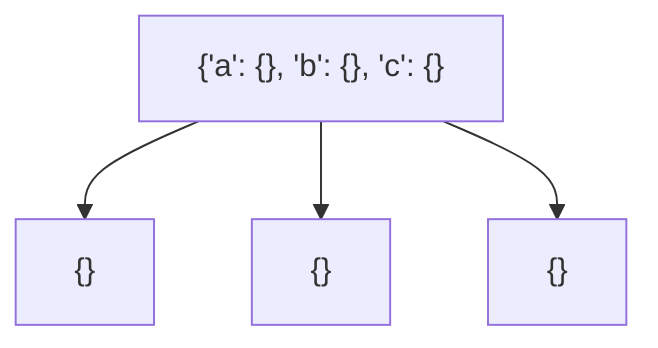
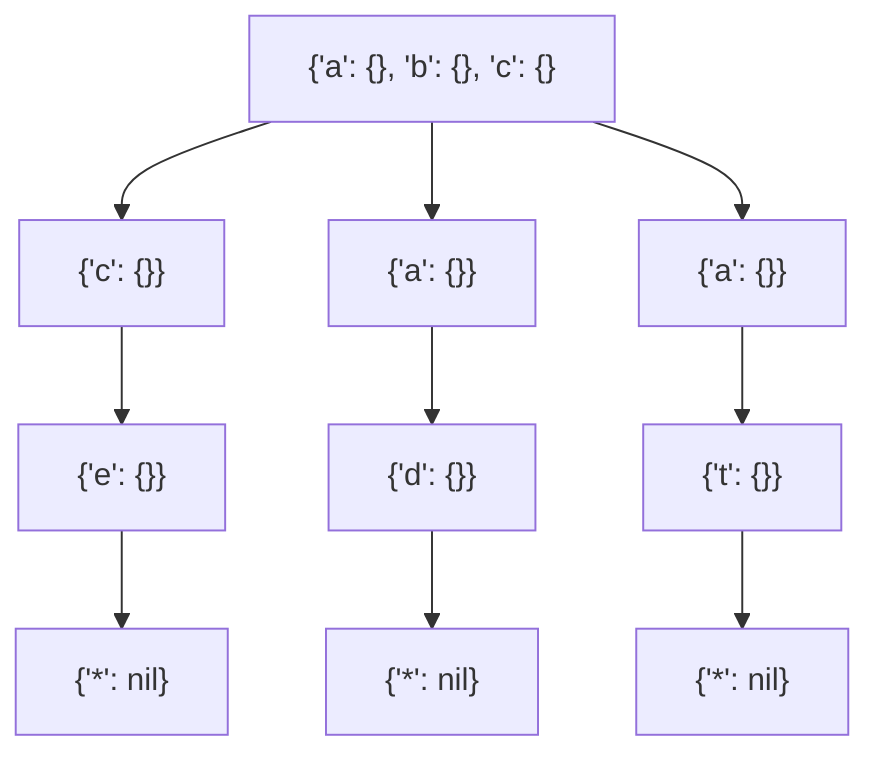
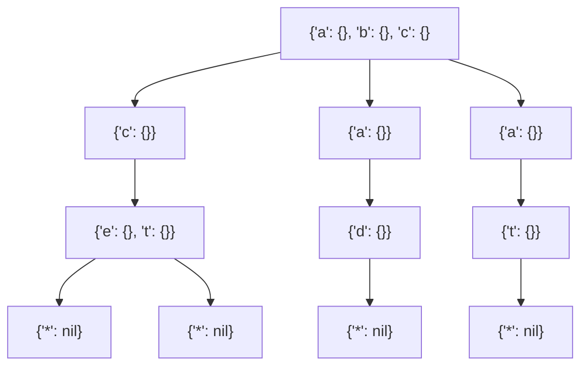
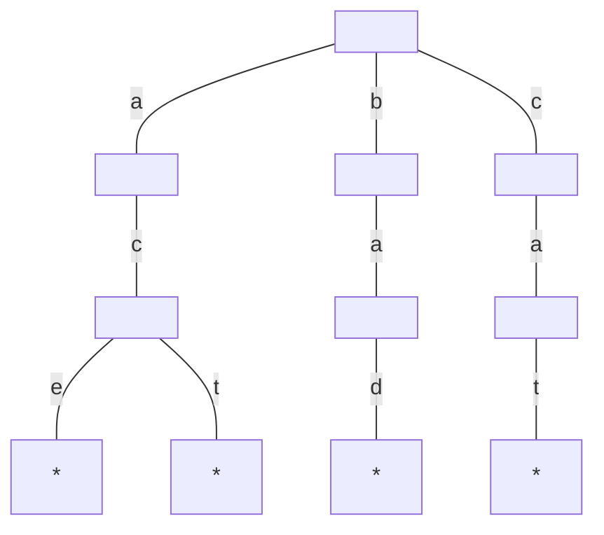
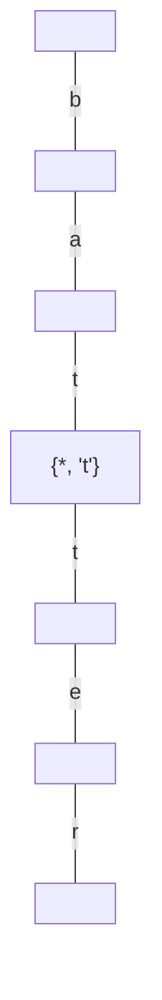
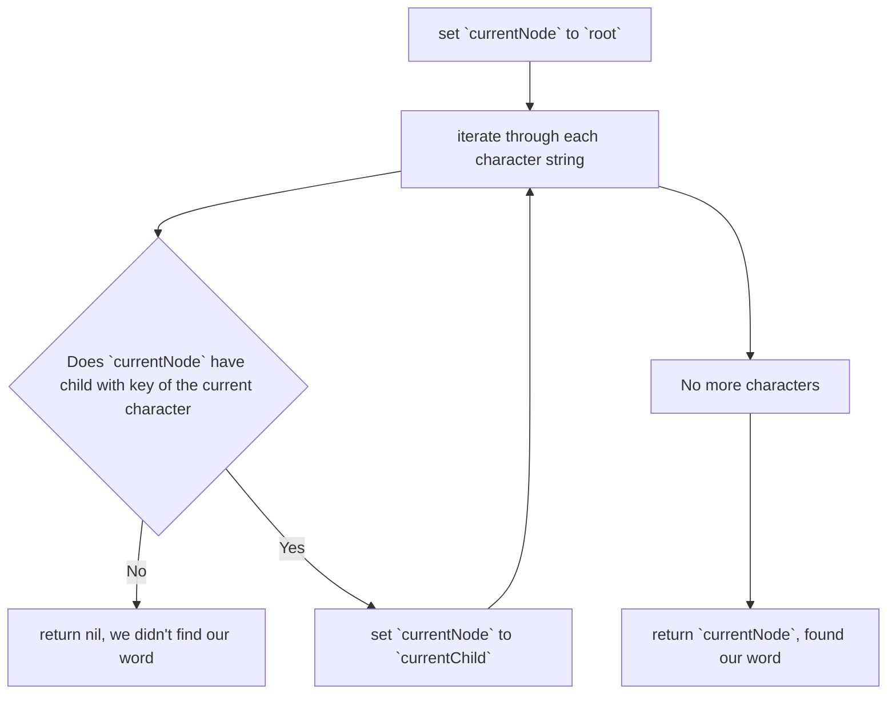
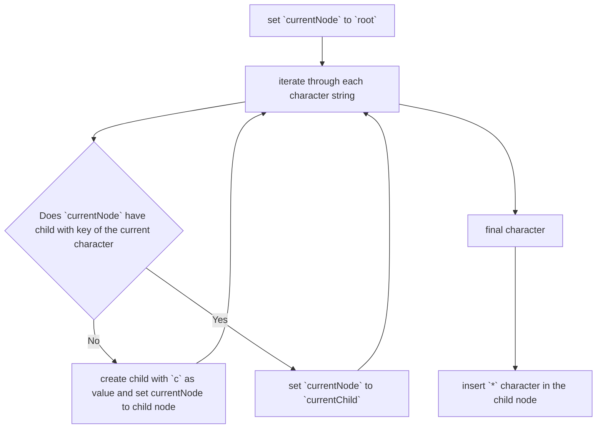
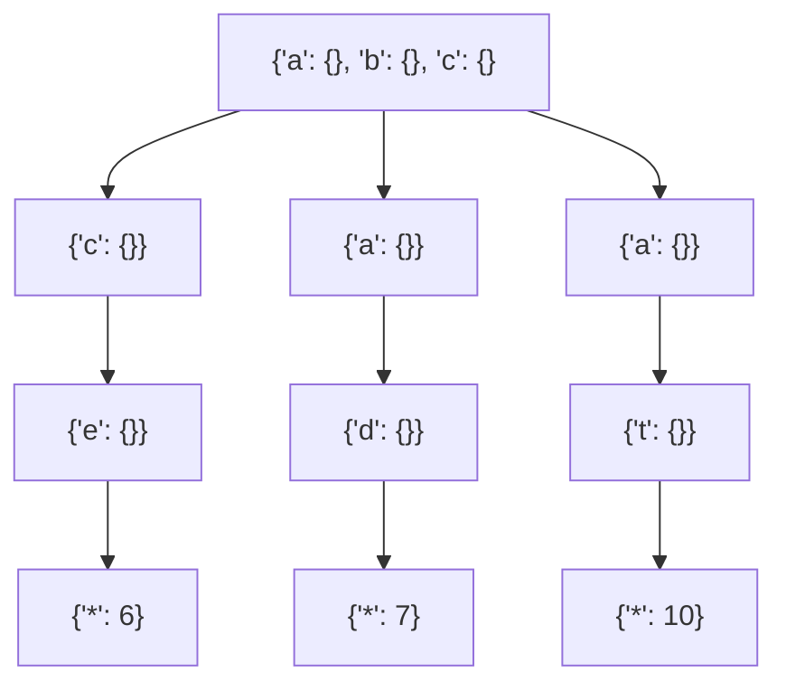
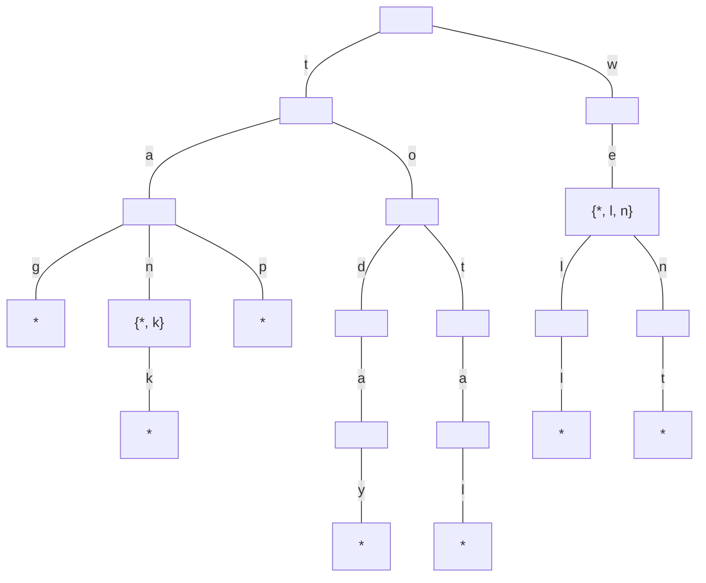

# It doesn't hurt to Trie

Tries are a special kind of tree. They can have many nodes (more than two) and are best used for text-based nodes for
features like AutoComplete.

The specialty of tries is what the node contains. The node elements are hash tables. Each key is a character in a
language. For English letters, this would look something like this:



The child nodes also contain hash tables pointing to other child nodes with hash tables in them.

Let's look at the definition of a:

```go
type TrieNode struct {
	Children map[rune]TrieNode
}

type Trie struct {
	Root TrieNode
}

func NewTrie() *Trie {
	return &Trie{
		Root: TrieNode{
			Children: make(map[rune]TrieNode),
		},
	}
}
```

## Storing Words

The point of our trie is to store words. Let's store some words now, for example: "ace", "bad", "cat".



This trie shows how we would access ace, bad and cat. The `*` at the end is there to signify the end of a word. Now,
let's also store the word `act`. Let's see what happens.



The two `*`s are a bit hard to follow, but one is coming from `e` and the other is the child of `t`.

This signify both words end at that point. The `{"e": {}, "t": {}}` node contains to child nodes.

There is an easier way to represent tries.



## The need for Asterisk

Let's say we have the word `bat` and `batter`. Stored with asterix this looks like this:



Without the `*` we wouldn't be able to find the word `bat`. In real life, tries contain thousands of words. Still, the
search performance is pretty good as we'll see later on.

## Trie Search

There are two flavours of search. Searching for a whole word and searching for a prefix.

The steps for prefix search are as follows:



Let's look at some code for this:

```go
func (t *Trie) Search(word string) *TrieNode {
	// Set root to current node.
	currentNode := t.Root

	for _, c := range word {
		if v, ok := currentNode.Children[c]; ok {
			currentNode = v
			continue
		}

		// We didn't find our word.
		return nil
	}

	// We found our word and return the current node to help the insert later on.
	return currentNode
}
```

This turned out to be pretty straightforward.

## The efficiency of Trie Search

It's not that straightforward. It isn't strictly O(n), and it isn't O(1) either. It is not O(log N). Why is it
not O(n)? Because `n` usually refers to the number of data elements in the data structure ( which would be the number of
nodes in our trie), but in this case, we only search each character of a string and not each node. So what is it?
It turns out it's its own O(K) category, where `K` denotes the number of characters. Neat.

## Insertion

Let's take a look at the insertion.



The code should look something like this:

```go
func (t *Trie) Insert(word string) *TrieNode {
	// Set root to current node.
	currentNode := t.Root

	for _, c := range word {
		// Update the node and go on...
		if v, ok := currentNode.Children[c]; ok {
			currentNode = v
			continue
		}

		// Create a new node with this new character
		next := &TrieNode{Children: make(map[rune]*TrieNode)}
		currentNode.Children[c] = next
		currentNode = next
	}

	// Lastly, when we are done finally, insert a last character to the last node.
	currentNode.Children['*'] = nil
	return currentNode
}
```

This was surprisingly straightforward as well.

## Building Autocomplete

Building autocomplete is actually easy now that we layed out our road so nicely.

```go
// CollectAllWords will collect all available words from a given Child Node.
// This is where it becomes handy that Search returns the last node.
// Because we'll search from that node onward for all available words in our
// autocomplete feature.
func (t *Trie) CollectAllWords(word string, node *TrieNode, words []string) []string {
	currentNode := t.Root
	if node != nil {
		currentNode = node
	}

	for k, v := range currentNode.Children {
		if k == '*' {
			words = append(words, word)
			continue
		}

		words = t.CollectAllWords(word+string(k), v, words)
	}

	return words
}

func (t *Trie) AutoComplete(prefix string) []string {
	currentNode := t.Search(prefix)
	if currentNode == nil {
		return nil
	}
	return t.CollectAllWords("", currentNode, []string{})
}
```

The comments try to explain how it works, but a test may show it more understandably.

```go
func TestTrieAutoComplete(t *testing.T) {
	trie := NewTrie()
	trie.Insert("ace")
	trie.Insert("bad")
	trie.Insert("cat")
	trie.Insert("bat")
	trie.Insert("batter")
	result := trie.AutoComplete("ba")
	sort.Strings(result) // we need to sort because we are dealing with a map
	// These are the characters or words that an autocomplete feature would autocomplete or
	// offer up as a word. The calling code must insert the prefix if it wants to display
	// full words.
	assert.Equal(t, []string{"d", "t", "tter"}, result)
}
```

Makes sense now, seeing the results.

## Tries with Values: A Better Autocomplete

Something that we didn't consider yet is weighing the results. For example, auto-completing all words is nice, but it is
nicer if it would sort the results based on popularity.

It turns out, we already have a way to do this. For now, we didn't use `*`'s child value. We could make it so that the
`*`'s value is a number that signifies popularity. It would look something like this:



Those numbers can then be used to sort the result accordingly and show the right word.

## Exercises

1. List all the words stored in the following trie:



Answer: tag, tan, tank, tap, today, total, we, well, went.

2. Draw a trie that stores the following words: get, go, got, gotten, hall, ham, hammer, hill, zebra.

3. Write a `Traverse` function for all nodes including `*`.

Answer:
```go
func Traverse(node *TrieNode, characters []rune) []rune {
	if node == nil {
		return characters
	}

	for k, v := range node.Children {
		characters = append(characters, k)
		characters = Traverse(v, characters)
	}
	return characters
}
```

4. Write an autocorrect that replaces a typo. If the input word is NOT in the trie, return the word with the longest
possible prefix shared with the input word. Example: "cat", "catnap", and "catnip". User types in "catnar"
return the word "catnap".

If the word is in there, just return the word. This is true for incomplete words as well.

Answer:

```go
func (t *Trie) AutoCorrect(prefix string) string {
	node := t.Root
	wordFoundSoFar := ""
	for _, c := range prefix {
		if v, ok := node.Children[c]; ok {
			wordFoundSoFar += string(c)
			node = v
			continue
		}

		return wordFoundSoFar + t.CollectAllWords("", node, []string{})[0]
	}

	return prefix
}
```
