# Connecting Everything with Graphs

The best example to explain a graph is used with Facebook friends and their friends. These connections are best depicted
with Graphs. But depicting them as a Graph does not just fit naturally, but actually allows us to look up friends
( connections ) in O(1) constant time.

So a _graph_ is a data structure which specializes in connections. For example, this is how a connection between a
couple of friends might look like:

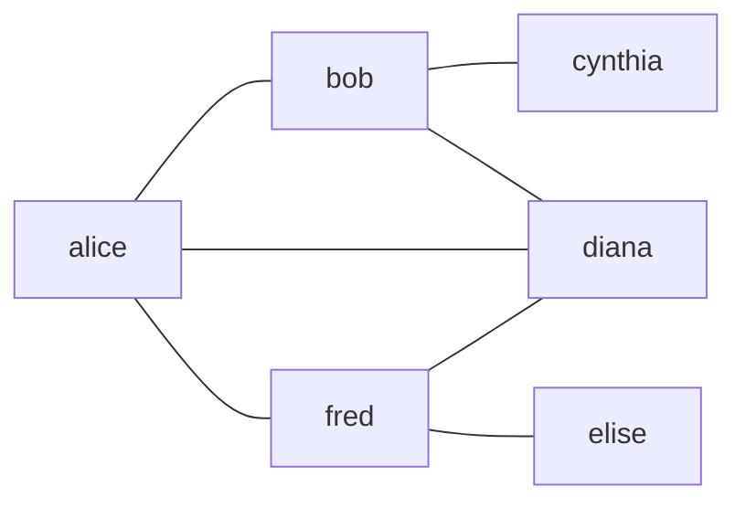

## Graphs vs. Trees

_Trees are a type of Graph_. But, _not all graphs are trees_. A tree cannot have any cycles. Nodes that point to a node
that points back at the original node. If a graph has a cycle, it's not a tree.

## Jargon

The nodes of a graph are called _vertex_ and the connecting lines are called _edges_. An edge next to another edge is
that edge's _neighbor_ and they are _adjacent_ to each other.

## Bare bone Graph implementation

Let's see how we can represent our graph:

```go
friends := map[string][]string{
    "Alice": []string{"Bob", "Diana", "Fred"},
    "Bob": []string{"Alice", "Cynthia", "Diana"},
    "Cynthia": []string{"Bob"},
    "Diana": []string{"Alice", "Bob", "Fred"},
    "Elise": []string{"Fred"},
    "Fred": []string{"Alice", "Diana", "Elise"},
}
```

## Directed Graph

In some cases _relationships_ are not _mutual_. One is friends with another, but that person is not marked as friend
with them. In that case, we use _arrows_ to depict the _direction_ of the connection.

That's called a _directed graph_.

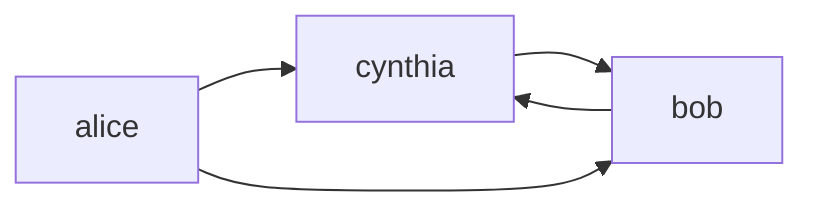

In code we can represent this as `followees`.

```go
followees := map[string][]string{
    "Alice": []string{"Bob", "Cynthia"},
    "Bob": []string{"Cynthia"},
    "Cynthia": []string{"Bob"},
}
```

The difference is that we are using the array to represent whom a specific person _follows_.

## Further implementation

Okay, let's create our graph now for real.

```go
// Vertex represents a single node of a graph.
type Vertex[T any] struct {
	Value     T
	Neighbors []*Vertex[T]
}

func (v *Vertex[T]) AddNeighbor(vertex *Vertex[T]) {
	v.Neighbors = append(v.Neighbors, vertex)
}

// NewVertex creates a new vertex with a given value and initializes the neighbor slice.
func NewVertex[T any](value T) *Vertex[T] {
	return &Vertex[T]{
		Value:     value,
		Neighbors: make([]*Vertex[T], 0),
	}
}
```

Pretty straightforward so far.

```go
	alice := NewVertex("alice")
	bob := NewVertex("bob")
	cynthia := NewVertex("cynthia")

	alice.AddNeighbor(bob)
	alice.AddNeighbor(cynthia)
	bob.AddNeighbor(cynthia)
	cynthia.AddNeighbor(bob)
```

If this would be an undirected graph, we would also have to add `alice` to `bob` and `cynthia`. That would require a
slight modification to the `AddNeighbor` method.

```go
func (v *Vertex[T]) AddNeighbor(vertex *Vertex[T]) {
	if v.HasNeighbor(vertex) {
		return
	}
	v.Neighbors = append(v.Neighbors, vertex)
	vertex.AddNeighbor(v)
}

func (v *Vertex[T]) HasNeighbor(vertex *Vertex[T]) bool {
	for _, n := range v.Neighbors {
		if n == vertex {
			return true
		}
	}
	return false
}
```

We added the `HasNeighbor` check because otherwise it would end up in an infinite loop adding them to each other over
and over again. We could actually make this a bit better, if we would use `map[string]*Vertex` for neighbors so checking
if the neighbor already exists is an O(1) check. After the map change:

```go
// Vertex represents a single node of a graph.
type Vertex[T comparable] struct {
	Value     T
	Neighbors map[T]*Vertex[T]
}

func (v *Vertex[T]) AddNeighbor(vertex *Vertex[T]) {
	if _, ok := v.Neighbors[vertex.Value]; ok {
		return
	}
	v.Neighbors[vertex.Value] = vertex
	vertex.AddNeighbor(v)
}

func (v *Vertex[T]) HasNeighbor(vertex *Vertex[T]) bool {
	for _, n := range v.Neighbors {
		if n == vertex {
			return true
		}
	}
	return false
}

// NewVertex creates a new vertex with a given value and initializes the neighbor slice.
func NewVertex[T comparable](value T) *Vertex[T] {
	return &Vertex[T]{
		Value:     value,
		Neighbors: make(map[T]*Vertex[T]),
	}
}
```

## Graph Search

The most common operation is searching a graph. Graph traversal, if you will. With graphs, searching means we have
access to a vertex and must find a connection or path to another vertex.

For example, consider the following graph:

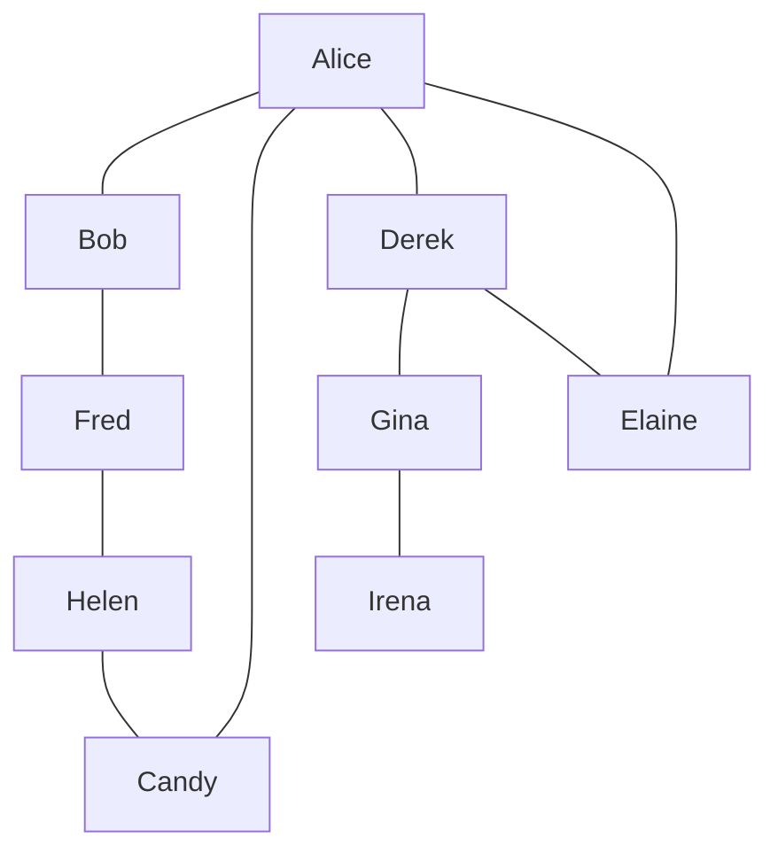

There are 2 different paths that we can take from Alice to Irena. Let's find the shortest path, an often used algorithm
in the wild.

## Depth-First Search ( aka. DFS )

There are two main ways to search a graph. DFS and BFS. _Depth-First Search_ and _Breadth-First Search_.

The key to searching any graph is to _keep track of the vertices that you already visited_. Otherwise, you could end up
in an infinite loop where you visit the same vertex over and over.

The steps of DFS are as follows:
1. Start with any random vertex
2. Add current vertex to visited map
3. Iterate through it's neighbors
4. For each vertex, if it has been visited already, ignore it
5. If it has not been visited, perform dfs on it recursively

For a really nice description of DFS, Dijkstra and A* visit https://www.redblobgames.com/.

Let's look at some code that will solidify this algorithm.

The book has two algorithms. One, a very basic one, which just traverses until there are no neighbors. And the next one
is the one searching for an actual value. I find the next one more interesting.

```go
func DFS[T comparable](current, goal *Vertex[T], visited map[T]struct{}) *Vertex[T] {
	if current.Value == goal.Value {
		return current
	}

	visited[current.Value] = struct{}{}
	for _, n := range current.Neighbors {
		if _, ok := visited[n.Value]; ok {
			continue
		}
		if n.Value == goal.Value {
			return n
		}

		found := DFS(n, goal, visited)
		if found != nil {
			return found
		}
	}

	return nil
}
```

Our map for neighbors still works nicely. Although the order will constantly change in Go, perhaps that has some other
negative effect I don't know of.

## Breadth-First Search

BFS does not use recursion. BFS uses a queue instead. Well focus on traversal for now.

The algorithm has the following steps:

1. Start at any vertex `start`
2. Add the vertex into a hash `visited`
3. Add the vertex to the queue
4. Pop an item from the queue call it `current`
5. Iterate over all neighbors
6. If the neighbor has not been visited yet, add it to visited and the queue
7. Repeat

Also, if there is a `goal` you can add a check if goal is reached, return early.

Let's see some code for this:

```go

func BFS[T comparable](start, goal *Vertex[T]) *Vertex[T] {
	queue := make([]*Vertex[T], 0)
	visited := make(map[*Vertex[T]]struct{})

	queue = append(queue, start)
	var current *Vertex[T]
	for len(queue) > 0 {
		current, queue = queue[0], queue[1:]
		if current == goal {
			return current
		}
		for _, n := range current.Neighbors {
			if _, ok := visited[current]; !ok {
				queue = append(queue, n)
				visited[n] = struct{}{}
			}
		}
	}
	return nil
}
```

Nice. The book goes a great length of walking through BFS and DFS, which I left out because I thought it was
straightforward from looking at the code and some output.

## DFS vs. BFS

BFS -> get closest connections first and fan out from there
DFS -> get the farthest connection first and work your way backwards

The question is, which one to use? It usually depends on what you are searching for. If you are in a map and want to do
a ping for immediate connections or find the first object as fast as possible, you would use BFS.

If you want a list of direct connections and aren't interested in everything in between, you would immediately get to
that goal and list the direct connection. That's DFS.

## Efficiency of Graph Search

It's not straightforward. We check each vertex so O(n) maybe? No. We also check each vertex's neighbors.

Let's walk through the following graph:

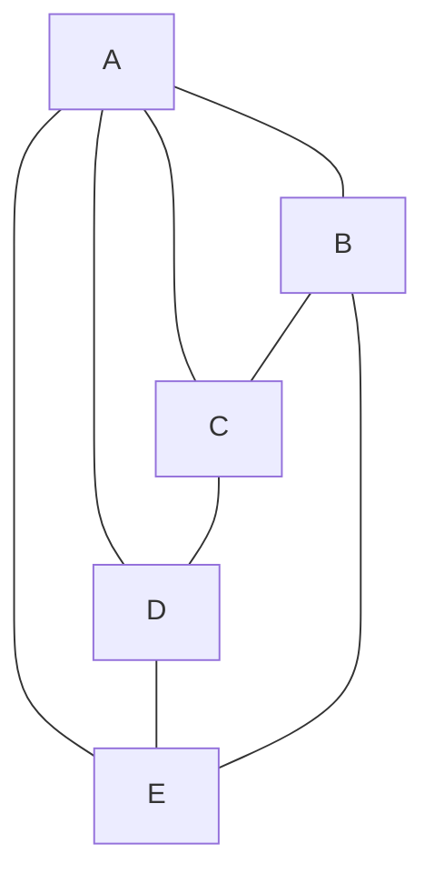

Vertex `A` has 4 neighbors. `B`, `C`, `D` and `E` has 3 each.

First, 5, because that's the number of vertices to check. Then another 16 checking all 4 neighbors which have 3 other
neighbors. That's 21 steps so far.

Looking at the following graph in comparison:

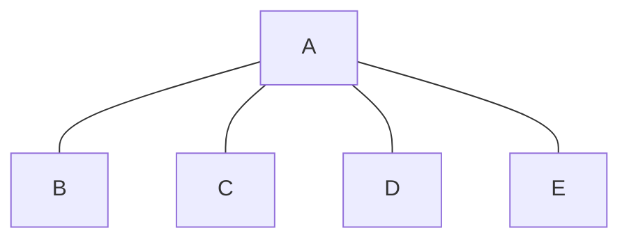

We have five vertices plus 8 iterations over the neighbors. That's 13 steps.

Now we can see that we can't just calculate the vertices we _also need to consider the neighbor count for each vertex_.
To describe this, we can use O(V + E). V is for vertex and E is for edges. However, there is a problem with this. Only
counting the edges does not produce an accurate value because one edge can be traversed more than once.

In reality, this would be something like 2 * edge between X and Y... But since Big O drops the constants we don't
describe that. Basically, O(V + E) is a good enough™ approximation.

## Weighted Graphs

Adds additional information to the edges. Here is a weighted graph:

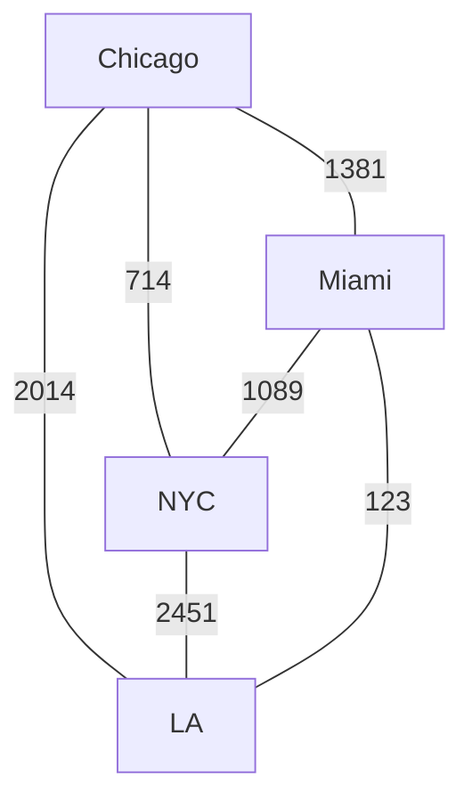

Directional weighted graph:

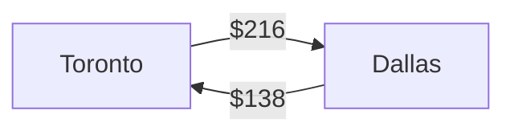

Here, we have different values going from one city to the other.

## Weighed Graph code

```go
type WeightedGraphVertex struct {
	Value     int
	Neighbors map[*WeightedGraphVertex]int
}

func (w *WeightedGraphVertex) AddNeighbor(vertex *WeightedGraphVertex, weight int) {
	w.Neighbors[vertex] = weight
}

func NewWeightedGraphVertex(val int) *WeightedGraphVertex {
	return &WeightedGraphVertex{
		Value:     val,
		Neighbors: make(map[*WeightedGraphVertex]int),
	}
}
```

## The Shortest Path Problem

Consider the previous graph we had. Let's convert that into a graph with prices in between the cities.

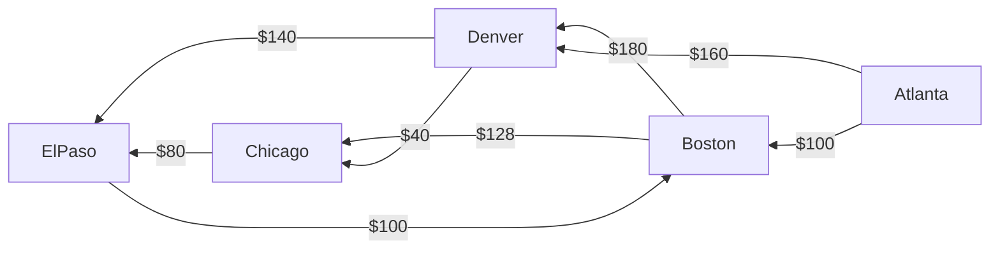

Now the question is, how to find the cheapest flight, or route from one of the cities to the other one. And if there is
a direct path to it, or some layovers need to happen.

### Dijkstra

There are a number of algorithms out there to find the shortest path. I believe, redblobgames mentioned previously is a
great place to look up how these algorithms work and look like. I especially recommend [this](https://www.redblobgames.com/pathfinding/a-star/introduction.html) post.

This algorithm returns all paths. So let's say we are looking for the cheapest path from Atlanta to El Paso. Dijkstra
doesn't just return this path. It returns all cheapest paths from Atlanta to any city that it can connect to.

We'll store these in a map. But a table might look something like this:

| From Atlanta to | Boston | Chicago | Denver | El Paso |
| --------------- | ------ | ------- | ------ | ------- |
|                 | $100   | $200    | $160   | $280    |

A hash table might look something like this:

```go
map[string]int{
	"Atlanta": 0,
	"Boston": 100,
	"Chicago": 200,
	"Denver": 160,
	"El Paso": 280,
}
```

Note that Atlanta is in there too. It makes sense since it costs nothing to get from Atlanta to Atlanta.

This is called a `cheapestPriceTable`. To also get the paths with layovers, we'll create another map called
`cheapestPreviousStopoverCityTable`. Might look something like this:

| Cheapest Previous Stopover City From Atlanta | Boston  | Chicago | Denver  | El Paso |
| -------------------------------------------- | ------- | ------- | ------- | ------- |
|                                              | Atlanta | Denver  | Atlanta | Chicago |

This is also implemented using hash tables.

#### Steps

1. Visit the starting city and make it current city
2. Check prices from current city to each neighbor
3. If the price to a neighbor is cheaper than the price currently in the hash table
4. Update `cheapestPriceTable`
5. Update `cheapestPreviousStopoverCityTable` making the neighbor the key and the current city the value
6. Visit each unvisited city has the cheapest price from the starting city and make that current city
7. Repeat steps 2-4

I'm not going to write down the walk-through mainly because I like redblobgames' description a lot better.

#### Finding the shortest Path

If we just want to know the cheapest from A->B we can look at `cheapestPricesTable` and see the immediate result. If we
want the full path, we have to follow back the bread-crumps. Something that redblobgames also has and calls `cameFrom`.

#### Implementation

Now, finally, let's see Dijkstra implemented.

This is an implementation from the book itself translated to go. The book also states that there are several kind of
implementations. One such implementation might use a Priority Queue instead. It looks similar to this but restructures
every time a new entry is added. You can find my implementation of that in the Grokking Algorithms book section [here](https://github.com/Skarlso/grokking-algorithms/blob/main/chapter07/dijkstra.go).

```go
type City struct {
	Routes map[*City]int
	Name   string
}

func NewCity(name string) *City {
	return &City{
		Name:   name,
		Routes: make(map[*City]int),
	}
}

func (c *City) AddRoute(city *City, price int) {
	c.Routes[city] = price
}

func DijkstraShortestPath(start *City, goal *City) []*City {
	cheapestPricesTable := make(map[*City]int)
	// cameFrom is a lot better... but let's stick with the book
	cheapestPreviousStopoverCityTable := make(map[*City]*City)

	// The book uses an array for this, I'm not sure why... A map is a lot simpler here.
	unvisitedCities := make(map[*City]struct{})
	visited := make(map[*City]struct{})

	// Set up start as 0.
	cheapestPricesTable[start] = 0

	current := start

	// We run as long as there are cities to visit.
	for current != nil {
		visited[current] = struct{}{}
		delete(unvisitedCities, current)

		// Go through all the routes of our city and calculate the price of each of them.
		// Later, we will select the cheapest.
		for city, price := range current.Routes {
			if _, ok := visited[city]; !ok {
				unvisitedCities[city] = struct{}{}
			}

			currentPrice := cheapestPricesTable[city] + price
			if v, ok := cheapestPricesTable[city]; !ok || currentPrice < v {
				cheapestPricesTable[city] = currentPrice
				cheapestPreviousStopoverCityTable[city] = current
			}
		}

		// Select the cheapest city to continue with.
		min := math.MaxInt64
		var minCity *City
		// Right, this is why it was using a ruby list. The ruby list had a very nice `min` function with a custom
		// checker in a `do |`.
		for c := range unvisitedCities {
			if cheapestPricesTable[c] < min {
				min = cheapestPricesTable[c]
				minCity = c
			}
		}
		current = minCity
	}

	// The core is done. Let's walk backwards to find the path
	shortestPath := make([]*City, 0)

	// We go backwards from the goal to start. Traverse the path back to the origin.
	currentCity := goal

	for currentCity != start {
		shortestPath = append(shortestPath, currentCity)
		currentCity = cheapestPreviousStopoverCityTable[currentCity]
	}

	shortestPath = append(shortestPath, start)

	// I'm returning this list, but it's in reverse order. I don't care.
	// The book does a .reverse ruby call.
	return shortestPath
}
```

This is a very interesting approach I might say.

#### Efficiency of Dijkstra

Efficiency varies based on implementation. This particular implementation has a worst-case of O(v^2). That can
happen when every node has a connection to every other node. An approach with a priority queue might be faster than this.

## Wrapping up

The book talks about how awesome graphs are and lists a couple of variations such as minimum spanning tree, topological
sort, bidirectional search, the Floyd-Warshall algorithm, the Bellman-Ford algorithm, and graph coloring, just to name a
few.

## Exercises

Graph 1:
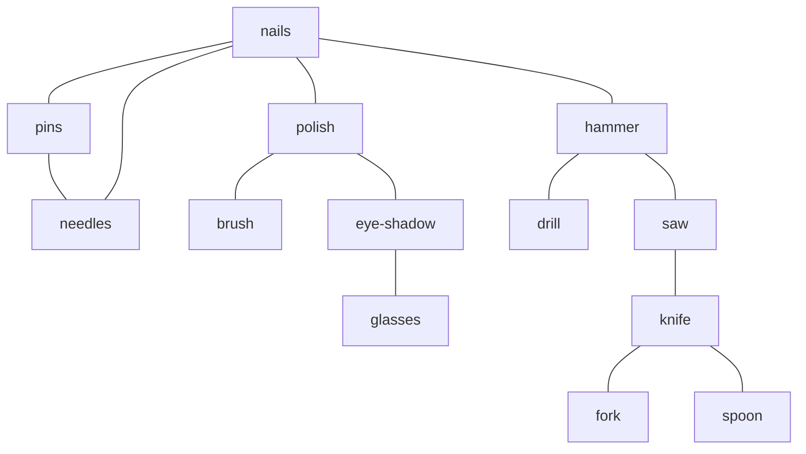

Graph 2:
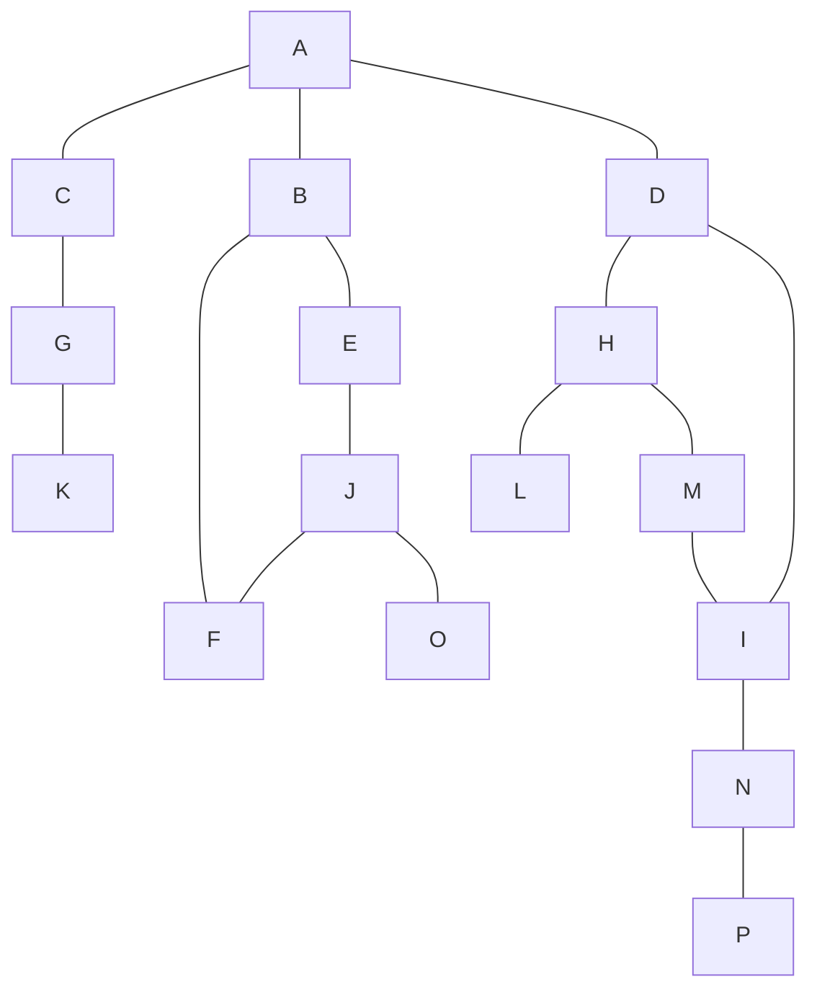

1. The first graph contains recommendations on an e-comers site. The edges connect similar products. If a user would
select `nails`, what other products will be recommended?

pins, needles, polish, hammer

2. If we do a depth-first search on the second graph starting with `A` what is the order in which we'll traverse all the
vertices? Assume that if given multiple choices of adjacent vertices, choose which ever comes earlier in the alphabet.

A-B-E-J-F-O-C-G-K-D-H-L-M-I-N-P.

3. What is the order with Breadth-First Search?

A-B-C-D-E-F-G-H-I-J-K-L-M-N-O-P.

It goes outwards in a "circle".

4. The traversal provided in Breadth-First search only traverses all nodes. Make it so that it stops when a goal is
reached.

I'm not sure what the authors means here. This is the breadth-first search:
```go
func BFS[T comparable](start, goal *Vertex[T]) *Vertex[T] {
```

This already has a goal oriented approach. `¯\_(ツ)_/¯`.

5. Get the shortest-path in an unweighted graph. The shortest path is the least amount of vertices to reach a vertex.

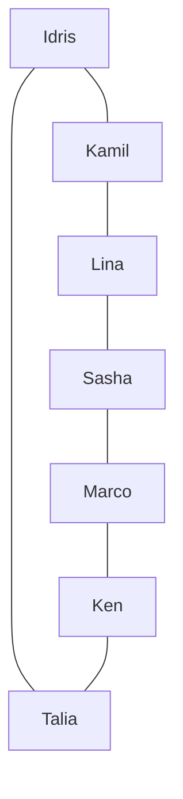

The shortest path from Idris to Lina is through Kamil. Idris-Kamil-Lina. And not the other way around. Write a function
that does this.

```go

func ShortestPath[T comparable](start, goal *Vertex[T]) []*Vertex[T] {
	queue := make([]*Vertex[T], 0)
	cameFrom := make(map[*Vertex[T]]*Vertex[T])
	cameFrom[start] = nil

	// BFS
	queue = append(queue, start)
	var current *Vertex[T]
	for len(queue) > 0 {
		current, queue = queue[0], queue[1:]
		if current == goal {
			break
		}
		for _, n := range current.Neighbors {
			if _, ok := cameFrom[n]; !ok {
				queue = append(queue, n)
				cameFrom[n] = current
			}
		}
	}

	// Path traversal backwards.
	current = goal
	var path []*Vertex[T]
	for current != start {
		path = append(path, current)
		current = cameFrom[current]
	}
	path = append(path, start)
	return path
}
```

The book said to use Dijkstra, but this is a perfectly valid, fine approach.
